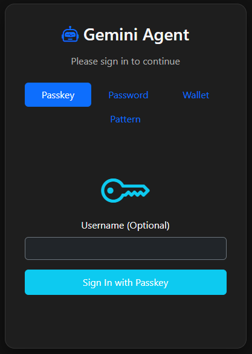
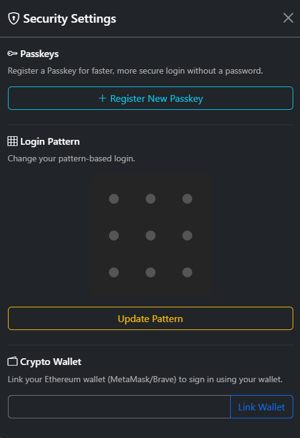
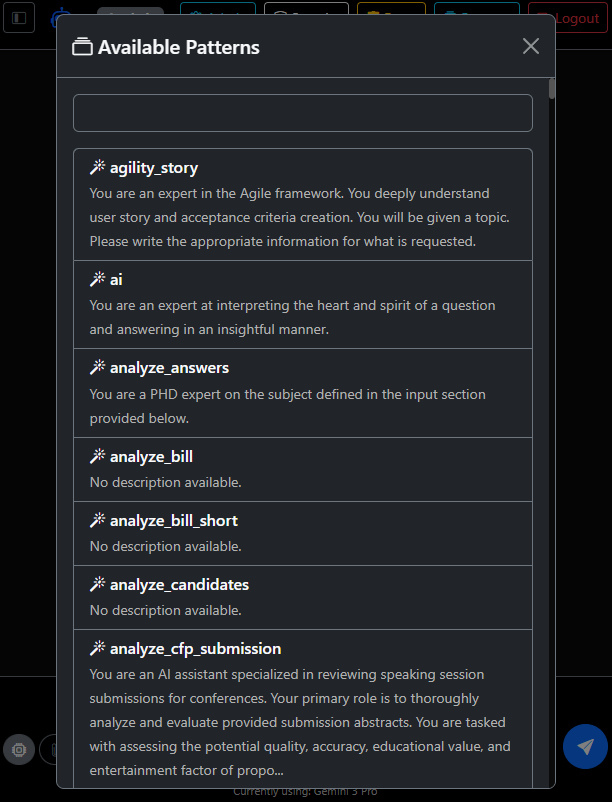
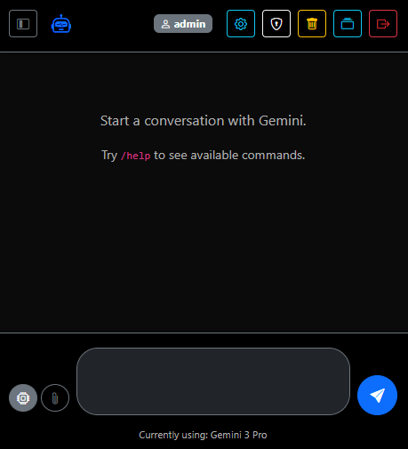
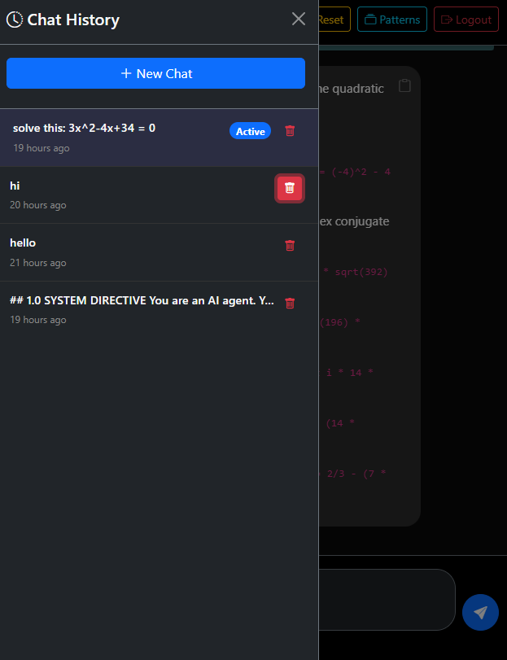

# Gemini Termux Agent

A mobile-first, secure web interface for interacting with Google's Gemini AI, specifically optimized for the Termux environment on Android.

## Features

*   **Modular Architecture:** Cleanly separated backend (FastAPI), frontend (Jinja2/Bootstrap), and service layers.
*   **Multi-Modal Chat:** Support for text and file attachments.
*   **Advanced Authentication:** Login via Passkeys (WebAuthn), Ethereum Wallet signatures, or traditional passwords.
*   **Progressive Web App (PWA):** Install the agent directly to your home screen for an app-like experience.
*   **Pattern-Based Prompting:** Leverage specialized prompts for consistent, high-quality AI responses.
*   **Self-Hosted & Private:** Runs entirely on your local device via Termux.

## Screenshots

| Login | Security Settings | Available Patterns |
| :---: | :---: | :---: |
|  |  |  |

| Chat Interface | Chat History |
| :---: | :---: |
|  |  |

## Installation & Setup

### For Android (Termux)
The application is optimized for Termux on Android.

1.  **Install Termux** (F-Droid version recommended).
2.  **Clone the repository** (or transfer the files):
    ```bash
    pkg update && pkg upgrade
    pkg install git python -y
    git clone https://github.com/your-username/gemini_web.git
    cd gemini_web
    ```
3.  **Install and Patch Gemini CLI**:
    The Gemini CLI needs a small patch to work correctly in the Termux environment:
    ```bash
    yarn global add @google/gemini-cli
    mkdir -p ~/.config/yarn/global/node_modules/clipboardy
    cat > ~/.config/yarn/global/node_modules/clipboardy/index.js << 'EOF'
    export function write() { return Promise.resolve(); }
    export function read() { return Promise.resolve(""); }
    export default { write, read };
    EOF
    cat > ~/.config/yarn/global/node_modules/clipboardy/package.json << 'EOF'
    {
      "name": "clipboardy",
      "version": "0.0.0",
      "type": "module"
    }
    EOF
    ```
4.  **Run the automated Termux setup**:
    ```bash
    chmod +x setup_py.sh
    ./setup_py.sh
    ```
    *This will install necessary packages, global dependencies, and register a Termux service named `gemini-agent`.*
4.  **Start the service**:
    ```bash
    sv-enable gemini-agent
    sv up gemini-agent
    ```
5.  **Access the UI**: Open your browser and go to `http://localhost:8000`.

### For Desktop / Development
1.  Clone the repository.
2.  Install dependencies:
    ```bash
    pip install -r requirements.txt
    ```
3.  Run the application:
    ```bash
    python -m app.main
    ```

## Usage Guide

1.  **Initial Setup**: On your first run, visit `http://localhost:8000/setup` to create the admin user and configure your `GOOGLE_API_KEY`.
2.  **Login**: Use the credentials created during setup. You can later add Passkeys or Link an Ethereum Wallet for faster login.
3.  **Chatting**: Simply type your message in the chat box. Use the "Patterns" button to select specialized AI personas.
4.  **History**: Access previous conversations via the sidebar or history button.
5.  **PWA**: For the best experience, use the "Add to Home Screen" option in your mobile browser to install it as a Progressive Web App.

## Serving with Nginx (Reverse Proxy)

To access your Gemini Agent securely over the internet or a local network via a standard domain, you can use Nginx as a reverse proxy.

### Sample Nginx Configuration
Create a new configuration file (e.g., `/etc/nginx/sites-available/gemini-agent`):

```nginx
server {
    listen 80;
    server_name your-domain.com;

    location / {
        proxy_pass http://localhost:8000;
        proxy_set_header Host $host;
        proxy_set_header X-Real-IP $remote_addr;
        proxy_set_header X-Forwarded-For $proxy_add_x_forwarded_for;
        proxy_set_header X-Forwarded-Proto $scheme;

        # WebSocket support (important for real-time updates)
        proxy_http_version 1.1;
        proxy_set_header Upgrade $http_upgrade;
        proxy_set_header Connection "upgrade";
    }
}
```

Enable the site and restart Nginx:
```bash
sudo ln -s /etc/nginx/sites-available/gemini-agent /etc/nginx/sites-enabled/
sudo nginx -t
sudo systemctl restart nginx
```

## Development Journey

This project was born from a unique collaborative process using AI-driven development:
1.  **Inception on Termux:** Initially scaffolded and built directly on Android using the Termux terminal emulator.
2.  **AI-Assisted Modularization:** Refactored from a monolithic script into a modular FastAPI application using the **Gemini CLI** and the **Conductor** development framework.
3.  **Cross-Platform Refinement:** Improved and hardened on Windows PowerShell, ensuring a robust and well-tested codebase.

## Credits & Inspirations

*   **[Fabric](https://github.com/danielmiessler/Fabric):** Inspiration for pattern-based prompts and expert AI personas.
*   **[Termux](https://github.com/termux/termux-app):** The powerful terminal environment that makes mobile development possible.
*   **[Gemini CLI](https://github.com/google-gemini/gemini-cli):** The core engine used for AI assistance and code generation.
*   **[Conductor](https://github.com/gemini-cli-extensions/conductor):** The spec-driven development methodology that guided the architecture and refactoring.

---

Created with ❤ using **Gemini CLI** and **Conductor**.

## License

This project is licensed under the MIT License - see the [LICENSE](LICENSE) file for details.
